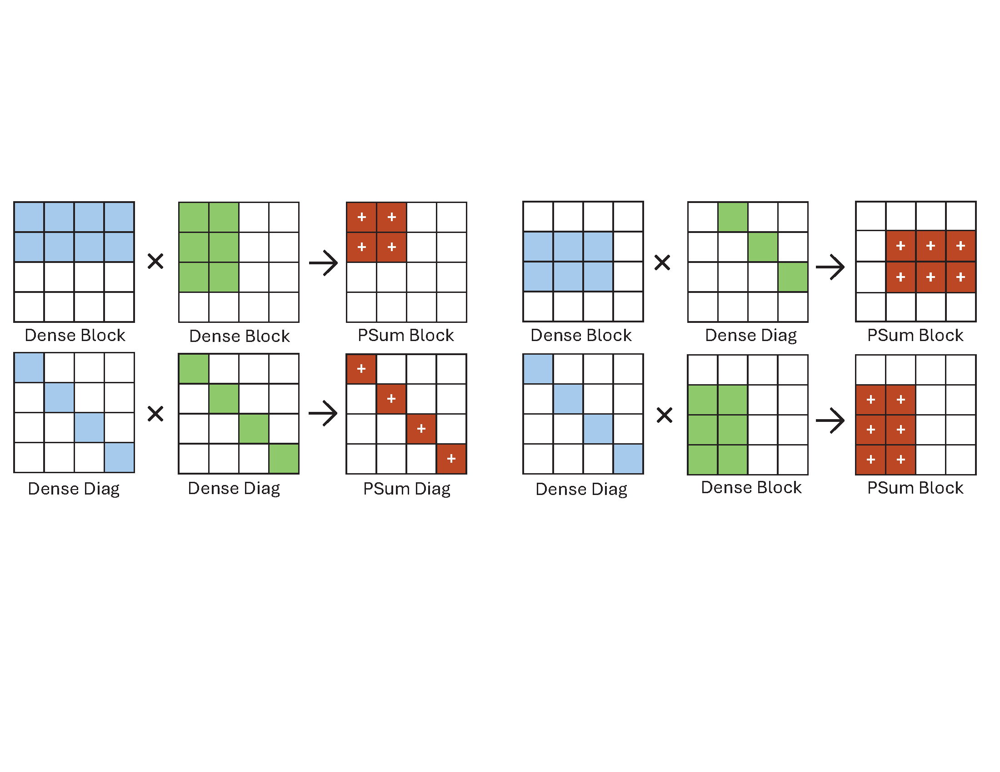

# Multi-Compressed-Matrix-Multiplier

## Introduction
This project attempts to perform sparse matrix-sparse matrix multiplication using a novel compression approach entitled "multi-compression." In this compression approach, structured sparse matrices are decomposed into lists of dense blocks and dense diagonals. The task of multiplying two matrices represented in this format as $A=A_{diag} + A_{block}$ and $B=B_{diag} + B_{block}$ can be broken down into four distinct dataflows $A\times B=A_{diag} \times B_{diag} + A_{diag} \times B_{block} + A_{block} \times B_{diag} + A_{block} \times B_{block}$. These dataflows are facilitated by a novel accelerator architecture using an array of processing elements which each individually perform multiplication on a pair of dense elements of a matrix.



## Kernels

The source for the multi-compressed matrix multiplication kernel can be found in the folder `./multi-compressed`. This kernel can be built as a component in Vitis-HLS. The top level function for the kernel is `kernel()`. The signature and arguments of the function are as follows

```
void kernel(const int a_num_rows,
            const int a_num_cols,
            const int b_num_rows,
            const int b_num_cols,
            const int a_num_dense_diags,
            const int a_num_dense_blocks,
            const int b_num_dense_diags,
            const int b_num_dense_blocks,
            const int a_dense_diag_start_addr,
            const int b_dense_diag_start_addr,
            const int a_dense_block_start_addr,
            const int b_dense_block_start_addr,    
            
            const ap_uint<128> *a_in_port,
            const ap_uint<128> *b_in_port,

            const ap_uint<32> *a_meta_in_port,
            const ap_uint<32> *b_meta_in_port,
            
            ap_uint<32> *out_port,
            
            int &write_back_counter,
            int &atomic_write_counter)
```

- `a_num_rows`, `a_num_cols`, `b_num_rows`, `b_num_cols` provide the shape of the input matrices. These ports are interpreted by HLS as s_axilite interfaces.

- `a_num_dense_diags`, `a_num_dense_blocks`, `b_num_dense_diags`, `b_num_dense_blocks` provide the number of dense diagonals and dense blocks in each input matrix. These ports are interpreted by HLS as s_axilite interfaces.

- `a_dense_diag_start_addr`, `b_dense_diag_start_addr`, `a_dense_block_start_addr`, `b_dense_block_start_addr` provide the offsets of the memory corresponding to the meta-data for the dense diagonals and dense blocks in the memory `a_meta_in_port` and `b_meta_in_port`. These ports are interpreted by HLS as s_axilite interfaces.

- `a_in_port`, and `b_in_port`, contain the non-zero values of the matrices stored as 32 bit floats. These are packed into a 128 bit wide memory. These ports are interpreted by HLS as m_axi interfaces.

- `a_meta_in_port`, and `b_meta_in_port` contain the meta data of the matrices stored as 32 bit unsigned integers. These ports are interpreted by HLS as m_axi interfaces.

- `out_port` contains the output data stored as 32 bit floats in dense format. This port is interpreted by HLS as an m_axi interface.

- `write_back_counter`, and `atomic_write_counter` are debug signals for the write back network. These ports are interpreted by HLS as s_axilite interfaces.

For more information contact `acoppens [at] umd [dot] edu`